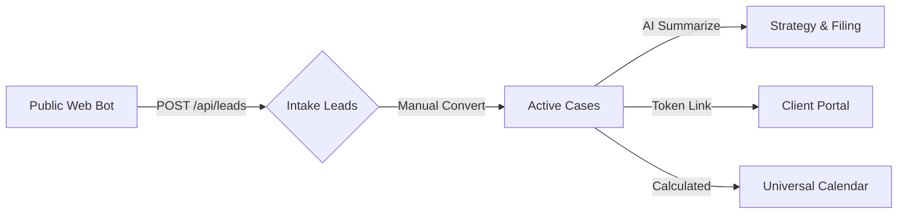

# ⚖️ LexFlow: The High-Impact Developer Hub

Welcome to **LexFlow**. This document isn't just a README—it's your "Map" to the litigation automation ecosystem.

---

## 🗺️ 1. The Core Lifecycle (User Flow)
How data moves through LexFlow.

---

## ⚡ 2. Feature & Management Cards (Kaha se kya hota hai?)

### 🤖 Intake Bot (The Gateway)
- **Kaha Se Create Hoga?**: Landing page (`/`) par bottom-right mein jo **Floating Bot Icon** hai, waha se user data enter karega.
- **Frontend Code**: `src/components/ui/intake-bot.tsx`
- **Backend API**: `POST /api/leads` (Creates new DB entry).

### 📋 Lead Hub & Manual Entry
- **Kaha Se Manage/Create?**: Sidebar -> **Intake Leads** (`/dashboard/leads`).
- **Manual Add**: Page par **"Add New Lead"** button dabayein modal open karne ke liye.
- **Logic File**: `src/components/dashboard/leads-table.tsx`
- **Actions**: Row items mein **Sparkles** (AI Draft), **Briefcase** (Convert), aur **External Link** (Portal Preview) icons hain.

### 💼 Litigation Conversion (The Bridge)
- **Kaise Trigger Hoga?**: **Intake Leads** Table mein jise "Convert" karna hai, uske **Briefcase icon** par click karke "OK" karein.
- **Backend API**: `PATCH /api/leads/[id]` (Updates status to `case`).
- **Managed In**: `src/app/api/leads/[id]/route.ts`.

### 📂 Active Cases (The Workhorse)
- **Kaha Se View?**: Sidebar -> **Active Cases** (`/dashboard/cases`).
- **Functionality**: Ye page filtered view dikhata hai. Yaha cases ki progress track hoti hai.

### 💬 AI Communication Center
- **Kaha Se Use Karein?**: Sidebar -> **Communications** (`/dashboard/chat`).
- **Feature**: Attorney-Client chat manage karne ke liye. Yaha AI suggestions bhi milti hain.
- **Code**: `src/app/dashboard/chat/page.tsx`.

### ⏳ Deadline Engine (The Brain)
- **Kaise Create Hoga?**: Lead/Case ke **History (Clock icon)** -> **Deadline Tracker** tab -> **Add Deadline (+ icon)** button -> Select Case Type.
- **Logic Engine**: `src/lib/deadline-calculator.ts`.
- **Backend API**: `POST /api/deadlines/[id]` (Calculates and saves milestones).

### 📄 AI Summarizer (Discovery Tool)
- **Kaha Se Run Hoga?**: Sidebar -> **AI Discovery** (`/dashboard/ai`).
- **Action**: PDF upload karein aur **Analyze** button dabayein. Result summarize hokar history mein save ho jayega.
- **Backend API**: `POST /api/ai/summarize`.

### 📅 Universal Calendar
- **Kaha Se View?**: Sidebar -> **Calendar** (`/dashboard/calendar`).
- **Use**: Saari deadlines aur client meetings ek central view mein dekhne ke liye.

### 🔒 Client Portal (The Transparency)
- **Kaise Access Karein?**: Leads/Cases table mein **External Link icon** par click karein.
- **Link Logic**: `src/app/portal/[id]/page.tsx`. Ye portal bina password (token-based) ke client ko case status dikhata hai.

---

## 📁 3. Tech Stack Edits for New Developers

| Requirement | Directory / Path | Action |
| :--- | :--- | :--- |
| **🎨 Global UI** | `/src/utils/utils.ts` | Theme logic aur Tailwind merge utilities. |
| **🛰️ Database** | `/src/lib/database.ts` | SQL queries aur Postgres connection pool. |
| **⚙️ AI Logic** | `/src/app/api/ai/` | Summarizer aur Draft logic (Simulation to Live conversion). |
| **💎 UI Widgets** | `/src/components/dashboard/`| Sidebar, Tables, Modals aur interactive components. |

---

## 🧪 4. Testing Your First Feature (Step-by-Step)

Want to see it in action? Follow this **"Lead-to-Portal"** test:

1.  **Step 1**: Visit `localhost:3000/` and complete the chat with the bot.
2.  **Step 2**: Login to `/dashboard` and check the **Intake Leads** tab. Your name should be there.
3.  **Step 3**: Click the **Sparkles** icon to generate an AI draft.
4.  **Step 4**: Click the **Briefcase** icon to convert to a case.
5.  **Step 5**: Visit **Active Cases**, click the **External Link** icon.
6.  **Success!**: You are now viewing the secure **Client Portal**.

---

## 🛠️ 5. Pro Developer Notes (Hinglish)
- **Design Rule**: Saari boundaries `rounded-xl` par set hain. Naya component banate waqt isse change na karein.
- **Mock vs Live**: Abhi AI outputs simulated hain. `Claude API` integration ke liye humne API routes ready rakhe hain.
- **Migration**: Naye table setup ke liye `scripts/` folder mein SQL files check karein.

---

**Built with Precision. Engineered for Justice.**
